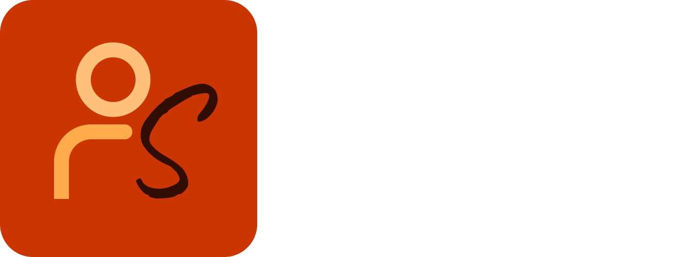
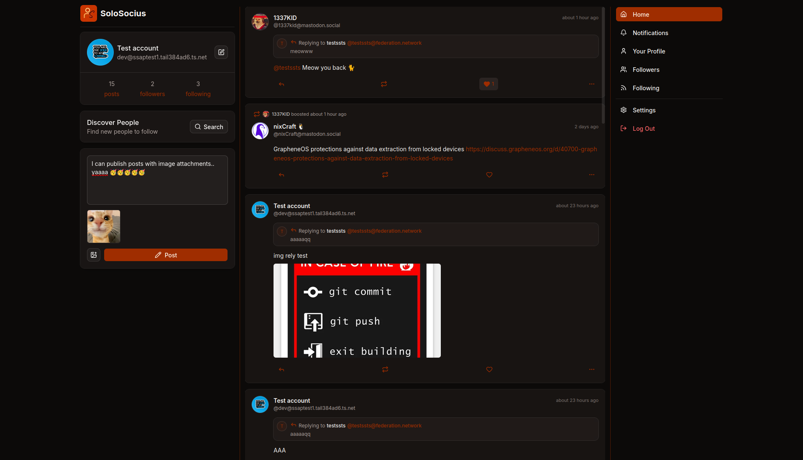

<p align="center">
    <br/>
    🔥 A lightweight, single-user ActivityPub server built for self-hosting. 🙋
</p>

---

SoloSocius is an experimental ActivityPub implementation focused on simplicity. It allows a single user to publish posts, interact with the [Fediverse](https://en.wikipedia.org/wiki/Fediverse) (Decentralised social network), and host their own social presence without the complexity of a multi-user platform.



---

> [!WARNING]  
> This project is still in development. SoloSocius is experimental software and should not yet be considered production ready.

# Features
- Single-user ActivityPub server
- Publish public posts
- Follow remote users on Mastodon, Misskey and other ActivityPub servers
- Receive remote posts in timeline
- Like and repost remote posts
- Publish posts and replies with image attachments
- Unfollow users
- Self-host with Docker

# Setup

Copy `Caddyfile.example` into `Caddyfile` and replace `localhost` with your domain name.

Copy `.env.example` into `.env` and make necessary changes.

```bash
git clone https://github.com/1337kid/SoloSocius.git
cd SoloSocius

cp .env.example .env
cp Caddyfile.example Caddyfile

docker compose build
docker compose up -d
```

# Tech Stack
Built with:
- Next.js
- Node.js
- Fastify
- PostgreSQL
- ActivityPub
- Docker
- Caddy
- AWS S3 Storage
- Redis

> [!NOTE]
> ActivityPub requires HTTPS for federation. Caddy is used as the reverse proxy and automatically provisions TLS certificates.

# License

MIT