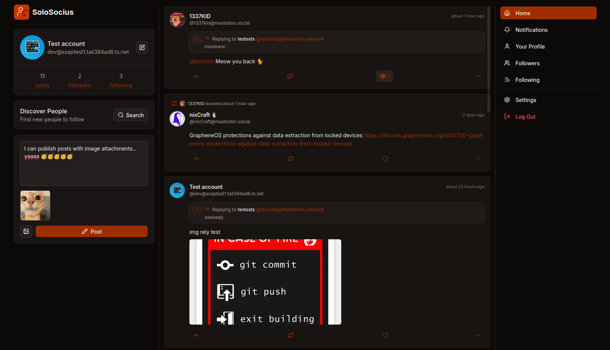

# SoloSocius

     
    🔥 A lightweight, single-user ActivityPub server built for self-hosting. 🙋

---

SoloSocius is an experimental ActivityPub implementation focused on simplicity. It allows a single user to publish posts, interact with the [Fediverse](https://en.wikipedia.org/wiki/Fediverse) (Decentralised social network), and host their own social presence without the complexity of a multi-user platform.

  

---

# Features
- Single-user ActivityPub server
- Publish public posts
- Follow remote users on Mastodon, Misskey and other ActivityPub servers
- Receive remote posts in timeline
- Like and repost remote posts
- Publish posts and replies with image attachments
- Unfollow users
- Self-host with Docker
